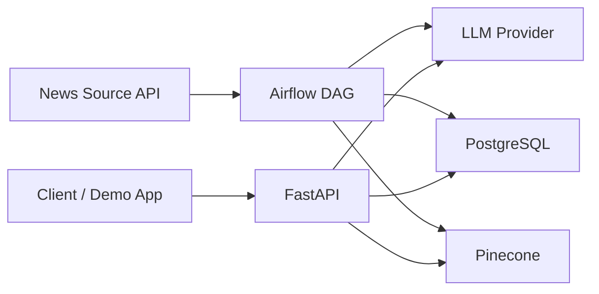

# NewsFlow AI

NewsFlow AI is a learning-first portfolio project that combines data
engineering, applied AI, and backend API design in one system.

The goal is to build an end-to-end pipeline that ingests news
articles, enriches them with summaries and embeddings, stores metadata
in PostgreSQL and vectors in Pinecone, and exposes a FastAPI service
for semantic search and grounded question answering.

## Status

This repository is currently in the architecture and scaffolding
phase. That is intentional.

Instead of pretending the project is already finished, this repo is
being built in small, reviewable steps so the Git history and
documentation show:

- how the system is designed
- why the architecture was chosen
- how the implementation evolves over time
- what was learned at each stage

That makes the repository more useful for learning and more credible
as a portfolio project.

## Why This Project Is Worth Building

- It demonstrates both batch processing and request/response API work.
- It uses LLMs for a concrete backend use case, not just a chatbot UI.
- It shows system design thinking: orchestration, storage boundaries,
  external dependencies, and tradeoffs.
- It creates material that is useful in interviews: architecture
  diagrams, design decisions, tests, documentation, and an API demo.

## What The System Will Do

1. Extract fresh articles from an external news source.
2. Transform those articles by cleaning text, generating concise
   summaries, and creating vector embeddings.
3. Load structured article records into PostgreSQL and embeddings into
   Pinecone.
4. Serve two main API capabilities:
   - semantic search over recent articles
   - RAG-style question answering grounded in retrieved news context

## Architecture At A Glance



For the full architecture write-up, including context, container,
sequence, and data-model diagrams, see
[docs/architecture.md](docs/architecture.md).

## Tech Stack

| Area | Tooling | Purpose |
|---|---|---|
| Orchestration | Apache Airflow | Schedule and monitor the ETL pipeline |
| Backend API | FastAPI | Expose search, RAG, and health endpoints |
| Relational storage | PostgreSQL | Store canonical article metadata |
| Vector storage | Pinecone | Store and query embeddings |
| LLM provider | OpenAI or Anthropic | Generate summaries and responses |
| Containers | Docker Compose | Local development environment |
| Python tooling | Ruff, Pytest, Pydantic | Linting, tests, validation, config |

## Learning Goals

This repo is designed to help you practice the following skills:

| Skill area | What you learn |
|---|---|
| ETL design | How to separate extract, transform, and load concerns |
| Orchestration | How Airflow DAGs model batch workflows, retries, and scheduling |
| LLM integration | How summaries, embeddings, prompts, and provider abstraction fit into a backend system |
| API design | How to define clean request/response contracts with FastAPI |
| Data modeling | How relational records and vector IDs work together |
| Testing | How to mock external services and verify behavior safely |
| Architecture communication | How to explain system boundaries, tradeoffs, and future evolution |

The step-by-step learning sequence lives in
[docs/learning-roadmap.md](docs/learning-roadmap.md).

## Planned Repository Structure

This is the target structure for the first working version:

```text
api/
  main.py
  schemas.py
dags/
  newsflow_daily.py
docs/
  architecture.md
  learning-roadmap.md
  project-structure.md
newsflow/
  config.py
  db.py
  extract.py
  transform.py
  load.py
  llm/
    __init__.py
    base.py
    openai_provider.py
    anthropic_provider.py
tests/
```

See
[docs/project-structure.md](docs/project-structure.md)
for the reasoning behind that split.

## Documentation Index

- [Architecture](docs/architecture.md)
  explains the system design and main tradeoffs.
- [Learning Roadmap](docs/learning-roadmap.md)
  breaks the project into implementation stages and concepts.
- [Project Structure](docs/project-structure.md)
  explains the role of each planned module and folder.
- [Backlog](BACKLOG.md)
  is the operational task list for building v1 through v4.

## Roadmap

- **v1:** core pipeline, API, local Docker environment, tests
- **v2:** CI/CD, observability, stronger test coverage, service split
- **v3:** AWS deployment and infrastructure-as-code
- **v4:** event-driven ingestion with Kafka/Redpanda

The tactical checklist for each phase is in
[BACKLOG.md](BACKLOG.md).

## Portfolio Guidance

To make this repository strong on GitHub, keep these standards:

- Be honest about project status. Clear scope is better than inflated
  claims.
- Keep the README, backlog, and diagrams in sync with the actual code.
- Build in small slices that can be explained in a commit history.
- Add tests and screenshots as soon as the API becomes runnable.
- Prefer clear tradeoff notes over buzzwords.

## Next Step

The best next milestone is not "write all the code." It is:

1. finalize the documentation baseline
2. scaffold the Python package and Docker setup
3. implement the v1 pipeline one stage at a time
4. keep learning notes and architecture docs aligned with the code

That process makes the project much easier to learn from and much
stronger as a portfolio artifact.
