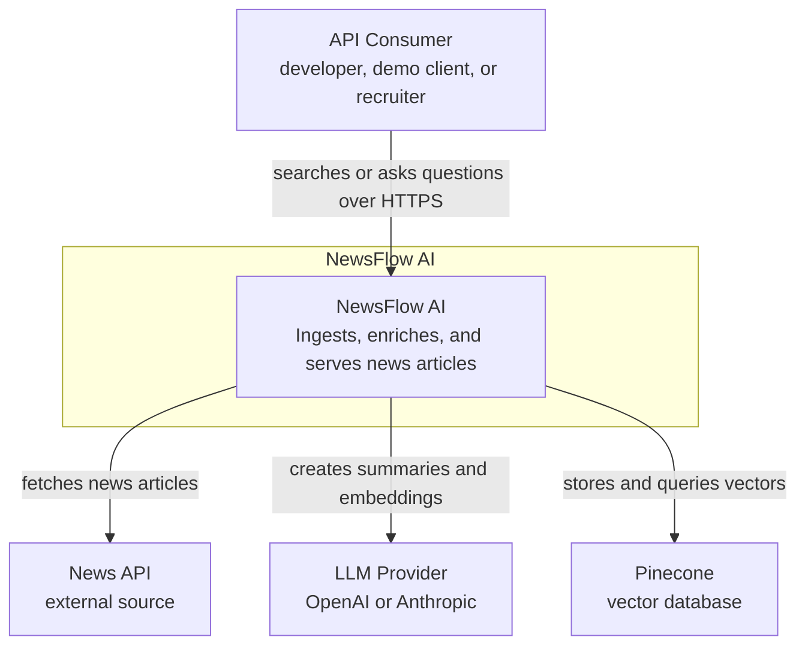
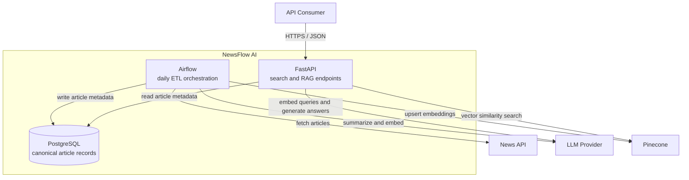
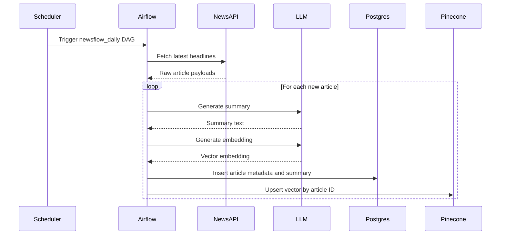
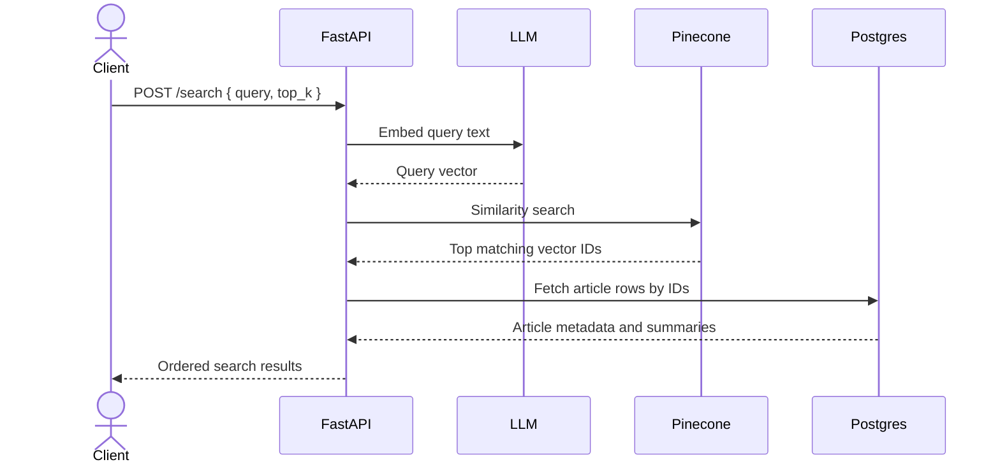
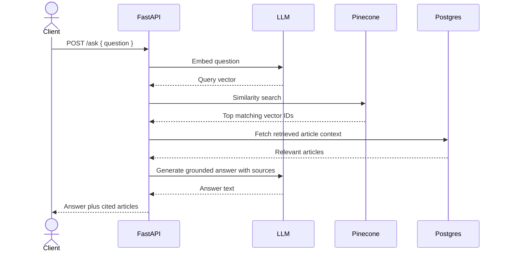
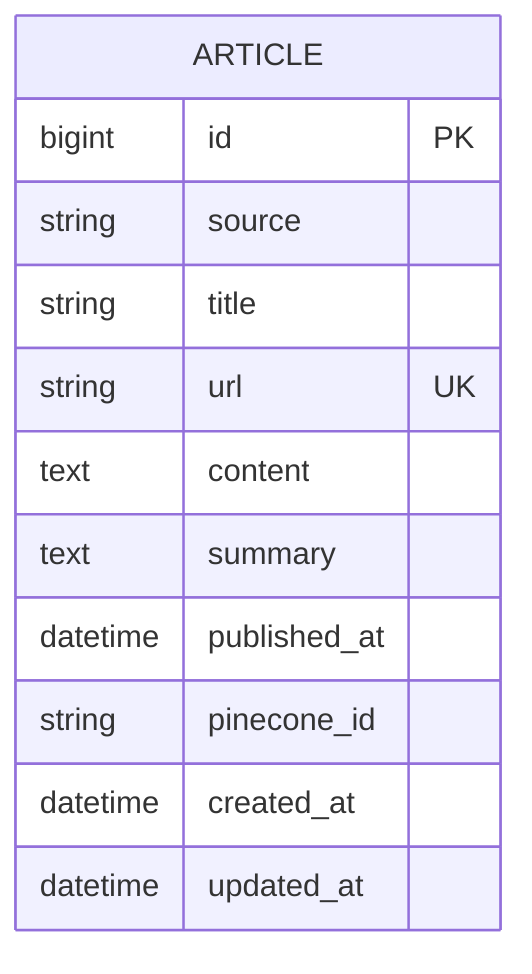

# NewsFlow AI Architecture

This document explains the system design of NewsFlow AI using a
simplified C4-style approach:

- system context: who uses the system and which external services it
  depends on
- container view: the main runtime pieces inside the system boundary
- sequence views: how the ingestion and query flows work
- data model: what the first version stores

The goal is to make the architecture easy to understand before the
code is fully implemented.

## Design Goal

NewsFlow AI is meant to be a small but complete backend system that
demonstrates:

- scheduled ingestion
- AI enrichment with summaries and embeddings
- hybrid storage using a relational database plus a vector database
- semantic retrieval through a clean HTTP API

This is intentionally a backend-heavy project. The purpose is to learn
system design and applied AI infrastructure, not to prioritize a rich
frontend in v1.

## v1 Scope

The first version focuses on a single end-to-end path:

1. fetch recent articles from an external news API
2. summarize and embed each article
3. store metadata in PostgreSQL
4. store vectors in Pinecone
5. expose search and RAG endpoints through FastAPI

Out of scope for v1:

- authentication and user accounts
- full observability stack
- event-driven pipelines
- cloud deployment
- multi-service microservice decomposition

Those are valuable topics, but they belong in later iterations.

## C1: System Context

### What this diagram teaches

- The user of the system is not an end consumer reading a website. It
  is an API consumer or demo client.
- The system depends on three external capabilities:
  - a source of news data
  - an LLM provider
  - a vector database
- The interesting part of the project is the orchestration between
  those systems, not any one dependency on its own.

## C2: Container View

### Container responsibilities

| Container | Main job | Why it exists separately |
|---|---|---|
| Airflow | Run the scheduled extract-transform-load workflow | Batch work has different retry, monitoring, and runtime needs than an API |
| FastAPI | Serve low-latency search and RAG requests | Online request handling should stay independent from ingestion jobs |
| PostgreSQL | Store the canonical article record | Relational data is easier to query, filter, and join than vectors alone |
| Pinecone | Store and search embeddings | Vector similarity is a separate storage concern from metadata |

Note: Airflow itself also needs framework-level metadata storage, but
that is not shown here because this document focuses on the domain
architecture of NewsFlow AI rather than every internal dependency of
third-party tooling.

## Ingestion Sequence

This is the daily batch flow.

### Why this flow matters

- It separates batch ingestion from query-time retrieval.
- It turns expensive enrichment work into an offline process instead
  of doing it on every API request.
- It gives you a natural place to learn retries, idempotency, and DAG
  design.

## Search Sequence

This is the request path for semantic search.

### What is important here

- Query embeddings are generated at request time.
- Pinecone returns candidate matches quickly, but it is not the source
  of full article truth.
- PostgreSQL holds the canonical data returned to the client.

## RAG Sequence

RAG reuses the search path and then adds one more LLM step.

### Why RAG is separate from search

Search returns retrieved documents. RAG returns a generated answer
grounded in those documents.

That distinction matters in interviews because it shows you understand
the difference between retrieval and generation.

## v1 Data Model

For the first version, a single `articles` table is enough.

### Why the schema is small on purpose

- One table keeps v1 easy to reason about.
- `url` is the natural deduplication key.
- `pinecone_id` links the relational record to the vector record.
- More tables can come later only when a real need appears.

## Key Design Decisions

### Airflow and FastAPI are separate runtimes

These workloads behave differently.

- Airflow is batch-oriented and can tolerate retries and longer jobs.
- FastAPI is request-oriented and should stay responsive.

Separating them makes the architecture easier to explain and easier to
evolve later.

### PostgreSQL is the source of truth for article data

Pinecone is optimized for nearest-neighbor search, not for storing the
full canonical article record. PostgreSQL is better for:

- filtering
- returning structured metadata
- enforcing uniqueness
- supporting future analytics or admin queries

### The LLM provider sits behind an interface

The code should use an abstraction such as `LLMProvider` instead of
hard-coding provider calls throughout the system.

That choice teaches a useful engineering concept:

- external APIs should be isolated behind boundaries
- swapping providers should not require rewriting business logic
- tests become easier when the interface can be mocked

### Enrichment happens offline, not at request time

Summaries and article embeddings are generated during ingestion so the
API can stay fast and cheap.

This is a meaningful architecture decision because it changes both
latency and cost.

## Tradeoffs and Risks

| Decision | Benefit | Cost or risk |
|---|---|---|
| Use Pinecone instead of local vector storage | Real hosted vector search experience | Adds another external dependency |
| Use Airflow for a small project | Strong orchestration story for portfolio value | More setup complexity than a cron job |
| Support multiple LLM providers | Better abstraction and experimentation | More code paths to test |
| Keep v1 as a modular monolith | Easier to build and reason about | Less independently scalable than separate services |

## How The Architecture Evolves

- **v1:** one ETL pipeline, one API, one relational store, one vector
  store
- **v2:** observability, CI/CD, stronger tests, possible internal
  service boundaries
- **v3:** cloud deployment on AWS-managed infrastructure
- **v4:** event-driven ingestion with Kafka or Redpanda

The important idea is to avoid designing v4 complexity into v1 code.
Each version should solve the problems of its stage well.
